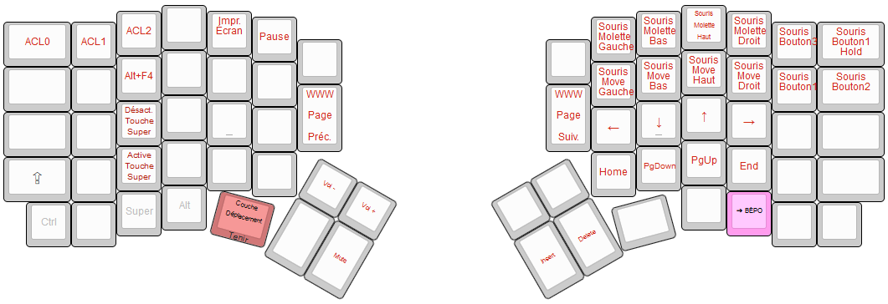
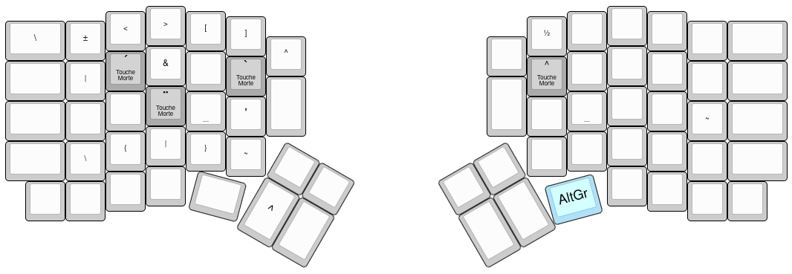

# Disopsition Bépo sur clavier Redox (Canadien Français)

 

Résumé en un clin d'oeil des fonctions courantes et du layer
principal - voir images dans les sections suivantes pour les détails
de chaque layer


## Détails

Ce projet contient un layout pour le [Clavier
Redox](https://github.com/mattdibi/redox-keyboard) ayant une
[Disposition Bépo](https://bepo.fr/wiki/Accueil) comme couche de base
(en tant que "wrapper" par-dessus la disposition Canadien Français
installé du côté OS), et ayant la disposition QWERTY standard dans une
deuxième couche. En d'autre termes, l'utilisation de cette disposition
est la suivante:

* En tout temps, le OS (Windows et Linux testé, support Mac inconnu)
  aura comme seul disposition de touches de configuré comme étant le
  [Canadien Français](http://kbdlayout.info/kbdca)
* Lorsque la couche 0 est utilisée, ceci agit comme un clavier Bépo
  du point de vue de l'utilisation, mais envoit au système
  d'exploitation les combinaisons de touches compatibles avec la
  disposition Canadien Français installé sur le OS. Essentiellement,
  cette disposition de touches Redox fait la "traduction" de
  Bépo vers le Canaiden Français.
* Le clavier Redox agira en bon vieux QWERTY lorsqu'en couche 1, une
  fois qu'on appuie sur la touche du coin en bas à droite sur la
  moitié de droite. Il est programmé le plus nativement possible pour
  les touches alphanumériques. (Évidemment, les autres touches sont
  des ajustements qui sont un peu plus "personnel", je présume que
  ceci est la norme en QMK :)
  
Pourquoi?

* Préférence personnelle par rapport au standard Canadien Multilingue
  (« CSA »). Je n'ai rien contre cette disposition, seulement
  j'utilise le Canadien Français depuis une longtemps :) ) ;
* Je voulais de quoi de « cross-platform » pour mes usages Windows et
  Linux. Unifier la disposition des touches dans tout mes OS semblait
  être un moyen de simplifier la configuration;
* « Wife acceptance factor »: je voulais que ma conjointe soit en
  mesure d'utiliser ce clavier lorsque branché à mon PC à la maison en
  échangeant très facilement de config clavier. Actuellement, appuyer
  sur la touche d'extrème droite en bas, sur la partie de droite, sert
  de « switch » entre le Bépo et le QWERTY ;
* Il y a peut-être une tonne de mauvaises pratiques QMK dans le code.
  Les habitués de QMK saigneront peut-être des yeux en consultant le
  code, mais je le partage en tant que "newbie" qui en a arrivé à une
  configuration fonctionnelle pour mes besoins, dans l'espoir de
  pouvoir aider le prochain nouveau venu qui cherche une config
  similaire au mien. Suggestions des vétérans QMK bienvenus!

## Layers supplémentaires

### Mouvement

 

### Fonctions

 

Le mode reset met le clavier en mode programmation, prêt pour flasher
un nouveau firmware. Ceci est l'équivalent à appuyer sur le bouton au
dos du clavier.

### Touches Natives (en cas de pépins avec le layer Bépo)

 

Ceci est pourrait être requis pour contourner les potentiels troubles
avec touches spéciales (implicant les F-Keys, modificateurs, ...) et
qui ne seraient pas fonctionnel sous la couche Bépo dans une
combinaison spéciale que je n'aurais pas vu ou testé.

### AltGr

 

La touche AltGr est "presque" standard avec Bépo, sauf pour la
dernière rangée de gauche. (Selon mes besoins).

Les touches mortes notés en gris sont répertoriés dans les layers
ci-bas. Seuls les lettres utiles dans le Français courant pour le
Québec (Canadien Français « *d'Amarique du Nord* » :) ) a été
implanté dans ce keymap.

Les lettres "accent" tel-quel (ex: `^`) sont atteignables en appuyant
sur espace, chose possible sur le clavier Canadien Français de base.

### AltGr Grave (touche morte)

 


### AltGr Aigu (touche morte)

 

### AltGr Circonflexe (touche morte)

 


## Omissions, déviation du standard Bépo et autres notes
Tel que mentionné plus haut, j'ai fait de mon mieux pour faire marcher
l'alphabet de base sous Bépo mais pas toutes les couches, car une
bonne partie ne fonctionnerait pas de manière /cross-platform/ entre
plusieurs OS. De plus, notez ces détails:

* ~~Bug majeur (fixed?): Les accents graves et aigus en majuscule ne
  fonctionnent pas pour le moment en accès via le modificateur AltGr.
  Par exemple, faire « `AltGr`-`è`, `Shift`-`A` » pour faire un `À` va
  seulement taper la lettre minuscule et sans accent.~~
* ~~Bug (fixed, CapsLock remapped): Les combinaisons `Shift+FKeys` (ex:
  `Shift+F1`) ne marche pas actuellement, car Caps Lock est attribué à
  Fn+Shift.~~
* Seulement les touches les plus communes, accessibles depuis le
  clavier Canadien Français, ont été transcris sur ce keymap. Ce n'est
  pas une solution "complète" ayant absolument tous les caractères
  inimaginables et obscures de Bépo :)
* Dû à la dispositon physique de clavier Redox, il me manquait en fait
  les touches à droite pour les lettres `z` et `w` sur la première
  rangée. Je les ai donc mis sur les touches doubles dans le milieu du
  clavier, ceux faisant partie des rangées 2 et 3, de façon temporaire
  à l'origine. Eh bien dans mon cas j'ai assez vite ré-appris avec ces
  emplacements non-officiel, ce qui en fait que je l'ai publié dans le
  projet tel-quel.
  * À noter que des touches non attribués existe à la suite du AltGr à
    droite; il ne serait pas impossible d'attribuer ces lettres mal
    placés à ces touches. Je laisse le soin « au prochain » de tester
    et voir si ça fait du sens. Dans mon cas, en double apprentissage
    Bépo et Redox à la fois, rajouter une autre rangée de lettres
    semblait pas du tout naturel à mes pauvres doigts qui en arrachait
    assez déjà :)
* J'ai personnalisé la série de touches `à`-`y`-`x`-`.`-`k` pour
  l'accès avec le modifieur `AltGr`, pour cette série non standard:
  `\`-`{`-`|`-`}`-`~`
* Il y a une touche raccourci `Alt+F4` sur la touche `Déplacement+É`,
  qui imite vaguement un `Ctrl+W` sur un clavier QWERTY.
* La touche d'extrème-droite d'en haut, BackSpace, sert
  essentiellement de compatibilité pour les pauvres gens empruntant
  mon clavier sous QWERTY; je ne savais pas à quoi l'attribuer sous
  Bépo. Je suis au courant de la redondance avec la touche à
  l'emplacement CapsLock d'un clavier standard :)
  * Également je reconnais la redondance pour Tab, au pouce gauche et
    à son emplacement standard.
* Noter que les touches de changements de couche ont la mention
  "Switch" ou "Tenir", qui font référence au comportement /
  utilisation de cette touche: "Tenir" est une touche qui s'active
  seulement en tenant la touche enfoncée, "Switch" bascule de manière
  permanente jusqu'à ce qu'on appuie dessus à nouveau.
  * Mon *killer app* est d'utiliser la disposition du mouvement de
	base de vim (touches `hjkl` QWERTY) tel quel sur ma main droite:
	en tenant la touche "Déplacement" et utiliser `CTSR` comme étant
	mes flèches du clavier. Voir les attribution de touches marqués en
	rouge sur la main droite dans l'image résumé du début du readme.

## Installation
Quoique pas un guide officiel, je vais présumer qu'il y a possibilité
que des gens débute avec le Redox (ou QMK en général) et cherche à
installer cette disposition (ou une disposition basée sur celui-ci,
genre avec vos modifications persos). J'en suis à mes premiers pas en
QMK également alors voici comment j'ai fait pour en arriver à faire
mon build:

* La [procédure de
  départ](https://beta.docs.qmk.fm/tutorial/newbs_getting_started) est
  à faire au complet, incluant le download du QMK Toolbox. La seule
  raison pourquoi je recommande de télécharger Toolbox est que,
  lorsque on met le clavier en mode RESET, Toolbox nous dit sur quelle
  port COM il est détecté. Ceci est nécessaire pour utiliser la
  commande de bas niveau `avrdude`. 
  * Le reset se fait de deux façons (à ma connaissance): soit appuyer
    sur le bouton dans le trou au dos du clavier à l'aide d'un
    trombone (si vous avez commandé un kit de pieds de chez Falbatech,
    leur clé Allen (« clé hexa ») qu'ils fournissent avec le kit peut
    servir d'alternative ), ou vous pouvez le faire en programmant une
    touche de votre choix sur la commande QMK `RESET`.
* Personnellement, j'utilise des scripts Bash dans l'interface MinGW64
  qui invoque `avrdude`. La documentation officielle de avrdude n'est
  pas toujours claire, mais voir sur le site de
  [LadyADA](http://ladyada.net/learn/avr/avrdude.html) pour une
  meilleure intro a cet outil.
* Pour l'avoir explicitement cherché sur le net, je note au passage
  que le [Configurateur QMK en ligne](https://config.qmk.fm/) est
  excellent pour se mouiller les pieds dans la création de configs
  sans toucher une ligne de code en C, hormis un défaut majeur pour ce
  qui touche Bépo: il semble impossible de créer des touches
  personnalisés- par exemple différencier la touche "'" ("N" en
  QWERTY) pour son utilisation avec ou sans Shift sous Bépo avec
  des lettres différentes. La création de macros, nécessaire pour
  gérer les touches avec des lettres différentes selon les
  modificateurs (Shift etc) appuyés, est pas possible avec le
  configurateur en ligne. On peut tout de même générer un fichier
  keymap.c de base sans macro et l'améliorer "hors-ligne" avec des
  macros. Pour exporter un keymap.c du configurateur, cliquez sur
  "Compile" et une fois compilé, cliquez sur Code Source
  * Pour la génération de fichier keymap.c, notez au passage qu'il est
    possible d'exporter et importer votre travail du QMK Configurator
    avec les deux boutons verts autour du mot "DISPOSITION.JSON", et
    qu'en prime on peut utiliser la commande `qmk json2c` dans notre
    environnement MinGW locale pour générer un keymap.c PRESQUE
    valide. Par "presque", c'est que dans les définitions des keymaps
    dans le fichier généré, il semble avoir quelques caractères qui
    saute (carrément omis de la génération) une fois de temps en
    temps. Par exemple, au lieu de voir `KC_D` on verrait `_D` ce qui
    n'est pas valide. Si vous convertissez un fichier json en keymap.c
    et que la compilation échoue avec des "références non définis",
    c'est votre devoir de faire le tour des définitions des keymaps à
    la main et de voir les incohérences. Dans ma courte expérience sur
    ce bug, en tout temps il y a eu 2 lettres à la fois
    (successivement) qui sautait.
* Le [Github officiel de
  Redox](https://github.com/mattdibi/redox-keyboard/tree/master/redox#firmware)
  mentionne comment flasher les contrôleurs brièvement, mais pour expliquer: 
  * Tenir la commande `avrdude` prête à être exécutée. Une fois qu'on
    appuie sur le bouton Reset au dos du clavier, le clavier tombe en
    mode RESET (équivalent à un mode recovery sous Android) pour
    environ 10 secondes max. Ensuite, le clavier redémarre en mode
    normal (exécute à nouveau le firmware) pour faire fonctionner le
    clavier normalement. Je recommande taper toute la commande de
    avrdude, avec ses paramètres, mais sans appuyer tout de suite sur
    Entrée. Appuyer sur Reset sur le clavier, et ensuite Entrée
    (depuis un autre clavier :) ) pour lancer votre commande avrdude
    lorsque le clavier tombe en mode Reset.
* Avant toute modifications, carrément le jour que j'ai reçu mon
  clavier, j'ai fait un backup des partitions sur le flash du clavier,
  au cas où tout tourne mal. J'ai trouvé ceci sur le net qui m'a donné
  des backups de chaque partition. Changer toute mentions de `COM5`
  dans l'exemple par ce que QMK Toolbox va vous dire lorsque le clavier
  bascule en mode reset.

```
#!/bin/bash
read -p "backup flash: Press enter to continue"
#avrdude -P COM5 -c avr109 -p atmega32u4 -U flash:r:backup_flash.hex:i
avrdude -P COM5 -c avr109 -p atmega32u4 -U flash:r:backup_flash.bin:r

read -p "backup eeprom: Press enter to continue"
#avrdude -P COM5 -c avr109 -p atmega32u4 -U eeprom:r:backup_eeprom.hex:i
avrdude -P COM5 -c avr109 -p atmega32u4 -U eeprom:r:backup_eeprom.bin:r

read -p "backup hfuse: Press enter to continue"
#avrdude -P COM5 -c avr109 -p atmega32u4 -U hfuse:r:backup_hfuse.hex:i
avrdude -P COM5 -c avr109 -p atmega32u4 -U hfuse:r:backup_hfuse.bin:r

read -p "backup lfuse: Press enter to continue"
#avrdude -P COM5 -c avr109 -p atmega32u4 -U lfuse:r:backup_lfuse.hex:i
avrdude -P COM5 -c avr109 -p atmega32u4 -U lfuse:r:backup_lfuse.bin:r

read -p "backup efuse: Press enter to continue"
#avrdude -P COM5 -c avr109 -p atmega32u4 -U efuse:r:backup_efuse.hex:i
avrdude -P COM5 -c avr109 -p atmega32u4 -U efuse:r:backup_efuse.bin:r
```

Le script demande de appuyer sur Enter, car après chaque download
effectué, le clavier n'attend pas ses 10 secondes et reboot en mode
normal d'utilisation immédiatement. Ce qui veut dire qu'à chaque
demande d'appuyur sur Enter, avrdude télécharge une partition et le
clavier redémarre immédiatement ensuite en mode normal pour
utilisation. Il faudra à nouveau appuyer sur le bouton Reset derrière
le clavier pour lancer la commande avrdude suivante. Note: les lignes
en commentaires dans le script ci-haut sont des exportations dans un
format alternatifs suggéré par LadyADA.


* Pour les commandes `qmk` (ex: `qmk compile`), le chemin par défaut
  dans lequel les fichiers résident est probablement
  "$HOME\qmk_firmware". Dans ma situation, en Windows, cela s'avérait
  à être `C:\Users\(username)\qmk_firmware`. La commande `qmk config`,
  qui résume les paramètres de configuration qu'on a inscrit dans la
  configuration initiale, va clairement montrer ces paramètres. Si on
  fait la config correctement, taper `qmk config` devrait écrire
  quelque chose de similaire à:

```
# qmk config
user.qmk_home=C:/Users/eric/qmk_firmware
user.keyboard=redox/rev1
user.keymap=bilange
```

Selon cette exemple de config, le code source qui sera utilisé pour
compilation est placé dans ce répertoire:
`C:\Users\eric\qmk_firmware\keyboards\redox\keymaps\bilange`

* Lorsqu'une commande `qmk compile` se complète avec succès, le
  fichier résultant, d'extension `.hex`, va être placé dans le
  répertoire configuré comme étant `user.qmk_home`. Dans mon cas,
  c'était un fichier nommé
  `C:\Users\eric\qmk_firmware\redox_rev1_bilange.hex`. 
* Une fois le fichier HEX créé, pour l'envoyer sur le Redox, la
commande suivante, affiché dans le repo officiel de Redox, est une
bonne base. 

	`avrdude -p atmega32u4 -P $(COM_PORT) -c avr109 -U flash:w:redox_rev1_default.hex`
	
Où $(COM_PORT) est le COM référencé par QMK Toolbox.

(Note: j'ai utilisé une seule fois l'interface de Toolbox pour flasher
le firmware original. Mon expérience est minime à ce sujet mais sachez
qu'il est possible d'utiliser Toolbox au lieu des lignes de commandes,
au besoin.)

* La doc de Redox indique clairement qu'il faut toujours explicitement
  flasher les deux côtés du clavier. Selon ma courte expérience, cela
  s'avère surtout vrai quand je jouais avec la configuration des LEDs.
  Autrement, flasher semble mettre à jour les deux côtés en même temps
  (??? par le câble TRRS????)
* Ma config QMK actuelle dans ce repo est DROITIÈRE (on branche le fil
  USB côté droit), quoique la fabrication standard d'un Redox (que ce
  soit via le service d'assemblage chez Falbatech ou si vous montez
  votre clavier Redox vous-même en suivant religieusement les
  instructions de câblage LED tel qu'affiché sur [le repo
  Github](https://github.com/mattdibi/redox-keyboard/tree/master/redox#assembly-guide))
  est GAUCHER. Ceci est changeable en définissant cet variables dans
  le fichier `config.h`:

```
// utiliser cette ligne pour une config gaucher (câble USB à gauche)
// #define MASTER_LEFT

// **OU** (ne pas définir les deux)

// utiliser cette ligne pour une config droitier (câble USB à droite)
#define MASTER_RIGHT
```

  Donc, si vous flashez cette config aveuglément et que vous vous
  retrouvez avec une configuration clavier "miroir", c'est-à-dire que
  par exemple les touches QWERTY partent de la DROITE et à reculons
  sur le clavier de droite (mais ceci affecte TOUT le clavier),
  brancher l'entrée USB de l'autre côté.
  * Fait intéressant pour l'utilisation droitière pour le clavier de
    Falbatech: la configuration des LEDs ne fonctionnera jamais
    lorsque branché à droite, car il est prévu que le câble soit la
    gauche, et ce au niveau électronique: le câblage (encore une fois,
    de FalbaTech et tel que les instructions Github) s'assure de
    relier les pins de data si elle parte de la gauche. On ne peut
    même pas utiliser LED_TOGGLE pour allumer ou éteindre les LEDs.
    Voir [les photos du repo Redox sur
    Github](https://github.com/mattdibi/redox-keyboard/tree/master/redox#rgb-underglow)
    qui donne un indice en ce sens.
